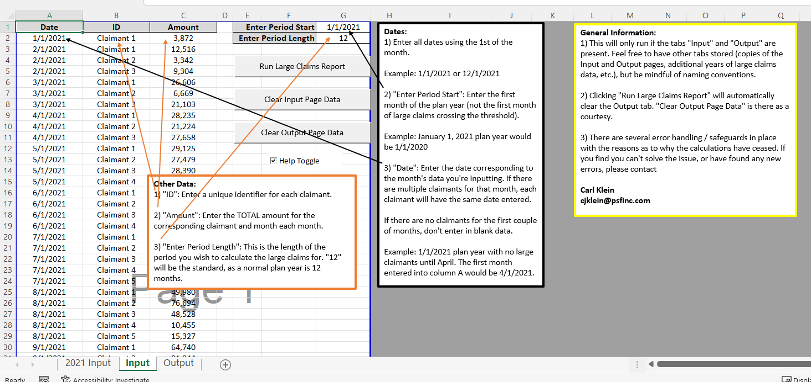

# VBA Project: Large Claim Automation
This model will take total expenses incurred by individual entities and break them down in periodic additives.
Initially designed to track growing expenses over a 12 month period, this model features the ability to track the breakout of any number of individual expenses over any number of months.

This model also contains several error handling features, some of the more important of these being:
- Dates: Improper Formatting
- Dates: Outside of Specified Time Period
- Data: Expense Dropping Below Reporting Threshold (i.e. appears in the initial months, disappears in future months)

## How to Use the Model
A "Help Toggle" button is included on the "Input" tab, simply follow those directions:

## Example
Uses randomly generated numbers over a 12-month period for five unique expenses, here is an example of the Input and Output of the model:

