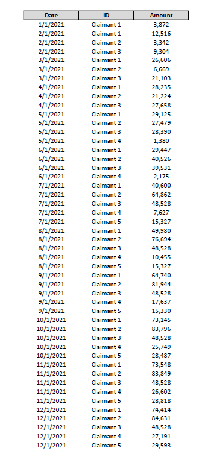
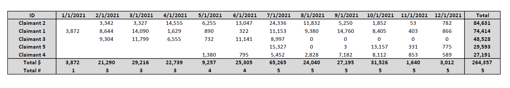

# VBA Project: Large Claim Automation
This model will take total expenses incurred by individual entities and break them down in periodic additives.
Initially designed to track growing expenses over a 12 month period, this model features the ability to track the breakout of any number of individual expenses over any number of months.

This model also contains several error handling features, some of the more important of these being:
- Dates: Improper Formatting
- Dates: Outside of Specified Time Period
- Data: Expense Dropping Below Reporting Threshold (i.e. appears in the initial months, disappears in future months)

## How to Use the Model
A "Help Toggle" button is included on the "Input" tab, simply follow those directions:

## Example
Here is an example of the Input and Output of the model using randomly generated numbers over a 12-month period for five unique expenses:

## Conclusion
Excel and other analytical tools have methods to achieve the Output presented in this model that don't require VBA or other programming concepts. However, when creating numerous reports that work with different sized datasets over different periods of time, this tool will help increase yield and reduce error.

## Reflection: Extensions & Edits
This section is for additional features or edits that could be useful, but haven't yet been addressed.

- Edit: The majority of the code is currently in a single main function. An edit would be to create functions that would be called in the main portion of the code. This would likely reduce redundancies, and look cleaner.
- Extension: Optional Datafields. Have this be ran out of a workbook that has a "control center" in it, and allows you to go further than the just the numerical data. Number of additional datafields would be toggleable, and there could even be preset datafields.
- Extension: Send to a database. Building off the "control center" and additional preset datafields idea, have the "control center" also be able to send the data to a database which stores other instances and time periods. There would be an error checker which would alert if matching data (entity name and time period being sent) was already present in the database, and would ask if you would like to override.

